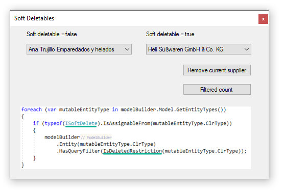

# Entity Framework Core 3x/5 soft deletables

This repository contains code to show how to use `HasQueryFilter` to provide soft deletes against any model which implements a specific Interface.

[Microsoft TechNet article](https://social.technet.microsoft.com/wiki/contents/articles/53834.entity-framework-core-3-x-global-query-filters-c.aspx)



### Setup
- Run [the following script](https://github.com/karenpayneoregon/ef-core-soft-delete/blob/master/EntityLibrary/DataScripts/script.sql) to create the database and populate tables.
- From Visual Studio solution explorer select Restore Nuget packages.
- Ensure `WindowsFrontEnd` or `WindowsFrontEndCore5` is the startup project.
- Build the solution
- Run

### EntityLibrary Requires
- Microsoft Framework 4.7.2 or higher
- Microsoft Visual 2017 or higher
- Microsoft SQL-Server 2012 or higher 

### EntityLibraryCore5 Requires
- Microsoft Framework .NET Core 5, C# 9
- Microsoft Visual 2019 or higher
- Microsoft SQL-Server 2012 or higher 

</br>

```csharp
private void RemoveCurrentSupplierButton_Click(object sender, EventArgs e)
{

    var currentSupplier = _supplierBindingSource.Current as Suppliers;

    if (!Question($"Remove {currentSupplier.CompanyName}")) return;

    using (var context = new NorthwindContext())
    {
        context.Entry(currentSupplier).State = EntityState.Deleted;
        context.SaveChanges();
        _supplierBindingSource.RemoveCurrent();
    }
}
```